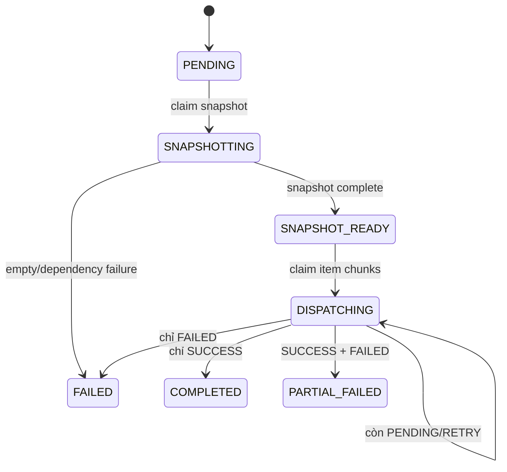
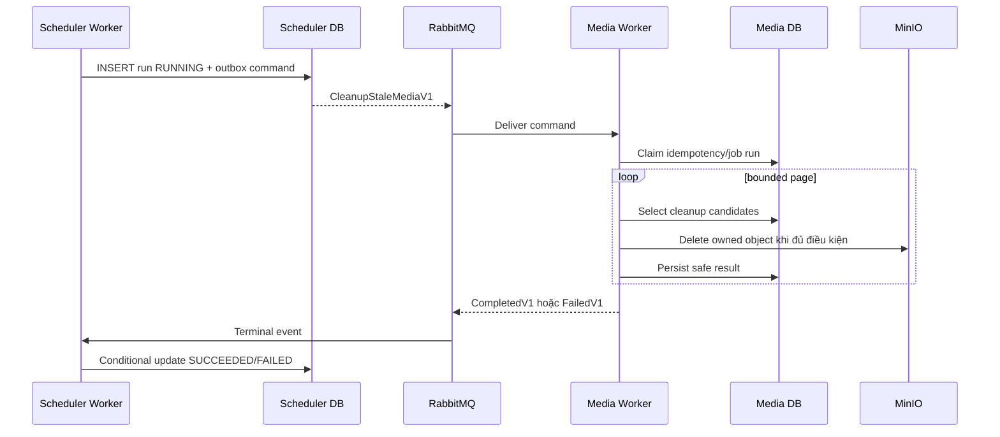

# Messaging và Worker Design

## Quy tắc chung

- QUERY cần response dùng typed HTTP; không dùng RabbitMQ.
- COMMAND có đúng một owner/consumer queue và được Send.
- EVENT mô tả việc đã xảy ra và được Publish.
- Consumer idempotent, dùng retry tập trung và kết thúc ở `_error` queue sau khi
  hết retry; không tự requeue vô hạn.
- Write database và phát message quan trọng phải dùng Outbox/Inbox hoặc cơ chế
  chống dual-write được duyệt.

## Contract inventory

| Contract | Kind | Producer → Consumer | Business/idempotency key | Trạng thái |
| --- | --- | --- | --- | --- |
| `GenerateMediaThumbnailV1` | COMMAND | Media API → Media Worker | `mediaId`/derivation job | Existing |
| `RegisterNotificationMediaUsageV1` | COMMAND | Notification API → Media Worker | notification ID + media usage tuple | Existing |
| `RegisterNotificationMediaUsageBatchV1` | COMMAND | Notification Worker → Media Worker | bounded notification IDs + usage tuple | Existing |
| `SnapshotNotificationBatchV1` | COMMAND | Notification API → Notification Worker | `batchId` | Existing |
| `DispatchNotificationBatchV1` | COMMAND | Notification Worker → Notification Worker | `batchId`; item protected by lease/token | Existing |
| `CleanupStaleMediaV1` | COMMAND | Scheduler Worker → Media Worker | `jobRunId` + `idempotencyKey` | Planned |
| `MediaCleanupCompletedV1` | EVENT | Media Worker → Scheduler Worker | `jobRunId` | Planned |
| `MediaCleanupFailedV1` | EVENT | Media Worker → Scheduler Worker | `jobRunId` + safe error code | Planned |

## Notification batch state



Design guard:

1. Snapshot đọc Student `ACTIVE` theo page và upsert theo
   `(batch_id, student_id)`.
2. Dispatch claim bounded chunk bằng lease; chỉ token hiện hành được ghi kết
   quả.
3. Lỗi business lần đầu chuyển `RETRY`; lỗi lần hai chuyển `FAILED`.
4. Item `SUCCESS` không được gửi lại khi command redelivery.
5. Notification/item/counter và outbox media usage commit theo bounded chunk.

## Scheduler cleanup contract đề xuất

`CleanupStaleMediaV1` thuộc Media Service vì Media là owner metadata và MinIO:

```text
jobRunId: UUID
idempotencyKey: string
requestedAtUtc: timestamp UTC
retentionBeforeUtc: timestamp UTC
pageSize: integer có giới hạn
correlationId: string
```

Media Worker validate cutoff/page size, tìm `PENDING` stale hoặc media không còn
active usage theo policy Media, xử lý theo page, rồi publish đúng một terminal
event:

```text
MediaCleanupCompletedV1(jobRunId, scanned, deleted, skipped)
MediaCleanupFailedV1(jobRunId, safeErrorCode)
```

Scheduler Worker cập nhật `background_job_runs` bằng conditional update theo
`jobRunId`. Event redelivery không thay đổi terminal run lần hai. Không đưa
bucket/object key hoặc exception raw vào event/summary.



## Failure và recovery

| Failure | Hành vi thiết kế |
| --- | --- |
| Command redelivery | Consumer nhận diện business key và không nhân đôi row/side effect. |
| Worker dừng giữa chunk | Lease/idempotency cho phép nhận lại; item đã terminal không xử lý lại. |
| RabbitMQ không sẵn sàng sau DB write | Outbox giữ message tới khi broker phục hồi. |
| MinIO delete object đã mất | Xem là idempotent success/skipped theo policy, không làm toàn run lỗi nghiêm trọng. |
| Dependency lỗi tạm thời | Retry tập trung; hết retry vào `_error`, lưu safe status/counter để trace. |

Scheduler hiện chưa có MassTransit persistence table. Việc chọn Outbox schema
và terminal-event contract phải được duyệt ở Q4-04 trước implementation.

