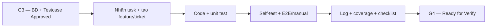

# Phase 5 — Development + Self-test

## Mục đích

Phase 5 chuyển spec, Basic Design và testcase đã duyệt ở Phase 4 thành runtime
code và test evidence. Mỗi function đi qua một ticket/branch riêng và chỉ được
handoff sang Phase 6 khi đạt G4 — Code Complete.

## Artefact

- [Implementation backlog](backlog/README.md)
- Runtime source: `backend/`, `frontend/` và `scripts/` theo phạm vi từng task.
- Automated test: test project của từng service và `tests/`.
- Test catalog/evidence: `docs/tests/` và evidence được chỉ định trong task.

## Nguyên tắc

- `docs/plan/` chỉ chọn task dự kiến làm trong ngày; không phải source of truth
  của backlog và không ép estimate bằng 8 giờ/ngày.
- Dev chỉ code function đã có SpecApproved, BDApproved và TestcaseApproved.
- Function `Existing` vẫn có task audit/hardening/test/evidence; không viết lại
  behavior đã đúng nếu không có gap được chứng minh.
- Unit/component/integration test và self-test nằm trong cùng implementation
  ticket, không dồn thành một task test cuối phase.
- Mọi thay đổi ngoài baseline phải quay lại Change Request; không sửa ngầm spec
  hoặc testcase trong lúc code.

## G4 — Code Complete / Ready for Verify

- [ ] F01–F18 có runtime evidence khớp baseline hoặc trạng thái/gap được ghi rõ.
- [ ] Unit test pass và coverage phần code thay đổi đạt ngưỡng dự án 80%.
- [ ] E2E/manual testcase approved của từng function pass 100%, không skip.
- [ ] Không còn known bug trước handoff.
- [ ] Jira có link PR, test log, coverage report và testcase checklist.
- [ ] README chạy/demo và performance evidence phản ánh kết quả thật.

Input của phase này được mô tả tại
[handoff Phase 4](../4/phase-5-handoff.md).
