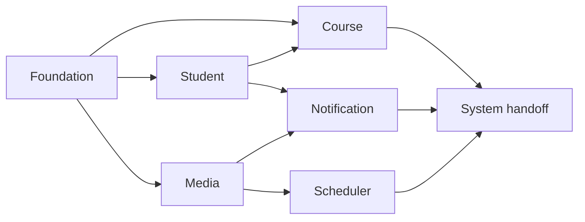

# Phase 5 Implementation Backlog

> **For agentic workers:** Mỗi task là một ticket/branch độc lập. Trước khi
> triển khai phải đọc skill HTTP method, test và migration tương ứng; thực hiện
> TDD, self-test và lưu evidence trước khi handoff G4.

**Mục tiêu:** Chuyển baseline Phase 4 đã duyệt thành backlog triển khai Phase 5
theo từng function, đủ rõ để Dev code mà không phải tự đoán behavior.

**Cách tổ chức:** Task được sắp theo dependency kỹ thuật, không theo ngày và
không ép tổng estimate bằng 8 giờ/ngày. Mỗi task tạo một increment có thể test,
review và handoff độc lập; function `Existing` được audit/hardening và bổ sung
evidence, function `Planned` được triển khai theo spec.

**Tech stack:** ASP.NET Core, EF Core/Pomelo, MySQL 8.4, MinIO, RabbitMQ,
MassTransit, YARP, NUnit, TestServer và Testcontainers.

## Giả định đầu vào đã khóa

Theo yêu cầu lập backlog, coi G2 và G3 đã duyệt cho mục đích estimate và chuẩn
bị task. Khi triển khai thật, Jira vẫn phải đính kèm đúng version của spec,
Basic Design và testcase đã approved.

- Q4-01..Q4-04 được coi là đã đóng theo đề xuất tại
  [Q&A](../../4/open-questions.md); nếu quyết định thực tế khác, phải mở Change
  Request và cập nhật baseline trước khi code.
- Mỗi task bên dưới có một ô `Ticket: Chưa tạo`. User thay bằng Jira key trước
  khi push code; branch là `feature/{mã backlog}` và target PR là `ducnm3`.
- Estimate là giờ Dev thực tế, đã gồm đọc baseline, code, test tự động,
  self-test, review/fix và cập nhật docs/evidence.
- Không tách unit/component/integration test thành ticket cuối kỳ. Test đi cùng
  function theo Document-Driven + Test-Driven.

## Thứ tự triển khai

Thứ tự trong bảng là thứ tự ưu tiên an toàn. Các task chỉ được chạy song song
khi toàn bộ dependency của từng task đã Done.

| Thứ tự | Task | Function/NFR | Loại | Est | Ticket | Chi tiết |
| ---: | --- | --- | --- | ---: | --- | --- |
| 1 | Chuẩn hóa Docker Compose và runtime baseline | NFR-ENV-01 | Hardening | 5 giờ | `Chưa tạo` | [Foundation](foundation.md#p5-01--chuẩn-hóa-docker-compose-và-runtime-baseline) |
| 2 | Chuẩn hóa error, identity, security và observability | NFR-ERROR-01, NFR-SEC-01, NFR-OBS-01 | Hardening | 6 giờ | `Chưa tạo` | [Foundation](foundation.md#p5-02--chuẩn-hóa-error-identity-security-và-observability) |
| 3 | Hoàn thiện tra cứu danh sách Học viên | F07 | Existing/hardening | 4 giờ | `Chưa tạo` | [Student](student.md#p5-03--f07-hoàn-thiện-tra-cứu-danh-sách-học-viên) |
| 4 | Hoàn thiện tra cứu chi tiết Học viên | F08 | Existing/hardening | 3 giờ | `Chưa tạo` | [Student](student.md#p5-04--f08-hoàn-thiện-tra-cứu-chi-tiết-học-viên) |
| 5 | Triển khai quản lý Khóa học | F01 | Planned | 8 giờ | `Chưa tạo` | [Course](course.md#p5-05--f01-triển-khai-quản-lý-khóa-học) |
| 6 | Triển khai quản lý Bài học | F02 | Planned | 6 giờ | `Chưa tạo` | [Course](course.md#p5-06--f02-triển-khai-quản-lý-bài-học) |
| 7 | Triển khai tra cứu Khóa học và tối ưu query | F03 | Planned | 12 giờ | `Chưa tạo` | [Course](course.md#p5-07--f03-triển-khai-tra-cứu-khóa-học-và-tối-ưu-query) |
| 8 | Triển khai ghi danh Khóa học idempotent | F04 | Planned | 8 giờ | `Chưa tạo` | [Course](course.md#p5-08--f04-triển-khai-ghi-danh-khóa-học-idempotent) |
| 9 | Triển khai cập nhật tiến độ Bài học | F05 | Planned | 6 giờ | `Chưa tạo` | [Course](course.md#p5-09--f05-triển-khai-cập-nhật-tiến-độ-bài-học) |
| 10 | Triển khai CSV streaming cho Khóa học | F06 | Planned | 8 giờ | `Chưa tạo` | [Course](course.md#p5-10--f06-triển-khai-csv-streaming-cho-khóa-học) |
| 11 | Triển khai direct upload và trạng thái draft ban đầu | F09 | Extension | 16 giờ | `ERBUL26-2914` | [Media](media.md#p5-11--f09-triển-khai-direct-upload-và-trạng-thái-draft-ban-đầu) |
| 12 | Hoàn thiện truy cập Media an toàn | F10 | Existing/hardening | 5 giờ | `Chưa tạo` | [Media](media.md#p5-12--f10-hoàn-thiện-truy-cập-media-an-toàn) |
| 13 | Hoàn thiện quản lý Media usage | F11 | Existing/hardening | 5 giờ | `Chưa tạo` | [Media](media.md#p5-13--f11-hoàn-thiện-quản-lý-media-usage) |
| 14 | Hoàn thiện tạo thông báo đơn | F12 | Existing/hardening | 5 giờ | `Chưa tạo` | [Notification](notification.md#p5-14--f12-hoàn-thiện-tạo-thông-báo-đơn) |
| 15 | Triển khai hộp thư đến và đánh dấu đã đọc | F13 | Planned | 8 giờ | `Chưa tạo` | [Notification](notification.md#p5-15--f13-triển-khai-hộp-thư-đến-và-đánh-dấu-đã-đọc) |
| 16 | Hoàn thiện tạo Notification batch | F14 | Existing/hardening | 5 giờ | `Chưa tạo` | [Notification](notification.md#p5-16--f14-hoàn-thiện-tạo-notification-batch) |
| 17 | Hoàn thiện snapshot recipient batch | F15 | Existing/hardening | 6 giờ | `Chưa tạo` | [Notification](notification.md#p5-17--f15-hoàn-thiện-snapshot-recipient-batch) |
| 18 | Hoàn thiện dispatch, retry và hiệu năng batch | F16 | Existing/hardening | 10 giờ | `Chưa tạo` | [Notification](notification.md#p5-18--f16-hoàn-thiện-dispatch-retry-và-hiệu-năng-batch) |
| 19 | Hoàn thiện theo dõi Notification batch | F17 | Existing/hardening | 5 giờ | `Chưa tạo` | [Notification](notification.md#p5-19--f17-hoàn-thiện-theo-dõi-notification-batch) |
| 20 | Triển khai Scheduler dọn dẹp Media | F18 | Planned | 12 giờ | `Chưa tạo` | [Scheduler](scheduler.md#p5-20--f18-triển-khai-scheduler-dọn-dẹp-media) |
| 21 | Hoàn thiện README và evidence handoff G4 | Toàn hệ thống | Handoff | 4 giờ | `Chưa tạo` | [Handoff](handoff.md#p5-21--hoàn-thiện-readme-và-evidence-handoff-g4) |
|  | **Tổng** |  |  | **147 giờ** |  |  |

## Gate chung của từng task

### Ready for Development

- [ ] Ticket đã có Jira key và branch `feature/{ticket}` được tạo từ `ducnm3`.
- [ ] Function ID, AC, Basic Design và testcase approved được link trên Jira.
- [ ] Dependency trong backlog đã Done; Q&A critical không còn Open.
- [ ] Skill endpoint/test/migration tương ứng đã được đọc trước khi sửa code.

### Ready for Verify — G4

- [ ] Code chỉ triển khai behavior trong baseline; thay đổi ngoài baseline đi
  qua Change Request.
- [ ] Unit test và các component/integration test liên quan pass; coverage phần
  code thay đổi đạt ngưỡng dự án 80%.
- [ ] Toàn bộ testcase approved của function được chạy, không skip, kết quả
  100% pass trước handoff.
- [ ] Không còn known bug; API docs, business flow, Postman và `docs/tests/`
  được đồng bộ với runtime evidence.
- [ ] Jira có test log, coverage report, checklist manual/E2E và link PR.

## Cách cập nhật `docs/plan/`

`docs/plan/` chỉ chọn task nào được làm trong một ngày cụ thể. Khi lập lịch,
copy Task/Est/Ticket từ backlog này; không đổi estimate để ép tổng ngày bằng 8
giờ và không chia một task dở dang thành nhiều ticket theo ngày.
