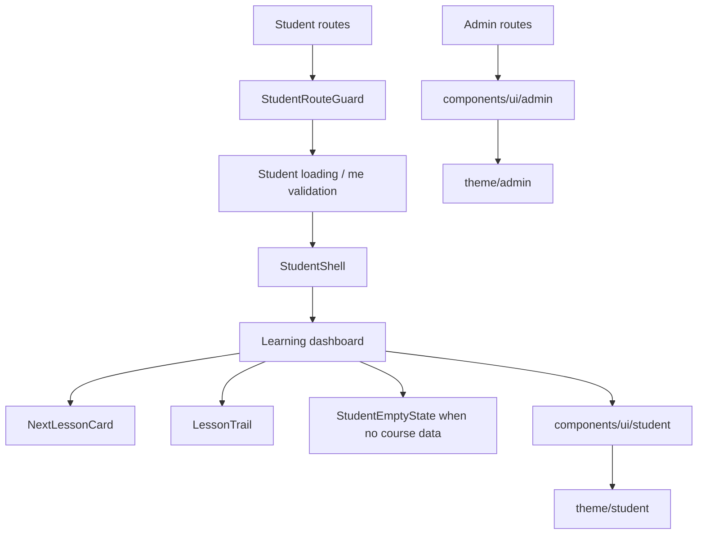

# Student Learning Trail UI design

## Purpose

Create a Student-only learning dashboard that feels encouraging and directs a
learner to the next useful action. The Student experience must be visually and
structurally independent from the existing Admin workbench while preserving the
React SPA, Tailwind, route guards, and separate Student local-storage identity.

> [!IMPORTANT]
> This scope is a frontend visual-system and dashboard composition change. It
> does not invent a Student course-overview API or display fabricated learning
> statistics. Until enrollment/progress data is exposed to the frontend, the
> dashboard presents an intentional empty state.

## Audience and direction

The user is a learner returning to continue a course. The visual metaphor is a
morning study desk: notebook paper, an indigo ink trail, a bookmark marking the
next lesson, and green checkmarks for work already complete. The chosen
signature is the **Lesson Trail**: a small sequence that gives “next”, “current”
and “completed” equal spatial meaning instead of reducing progress to a number.

Admin remains a compact teal workbench. Student is a more open, motivated
learning surface; Admin components and tokens must not change appearance.

## Architecture

### Folder boundaries

| Location | Responsibility |
| --- | --- |
| `src/components/ui/admin/` | Existing reusable Admin controls, migrated without visual behaviour changes. |
| `src/components/ui/student/` | Student-only primitives and learning dashboard components. Never import Admin UI. |
| `src/theme/admin/` | Existing teal Admin semantic tokens and class map. |
| `src/theme/student/` | Student semantic tokens, motion values, and class map. |
| `src/pages/student-auth/` | Page composition only for register, login, loading, logout, and dashboard. |
| `src/pages/student-auth/components/` | Student page-specific assemblies, not reusable UI primitives. |

The shared `ui` entry point is replaced by explicit `adminUi` and `studentUi`
exports. A component may consume only the matching actor namespace. Shared
non-visual utilities remain outside both folders.

## Student design tokens

All palette literals live only in `src/theme/student/tokens.css`. Student React
components consume semantic Tailwind classes from `studentUi`; no component
writes hex values, palette utility classes, or Admin color tokens.

| Token family | Value / role |
| --- | --- |
| Canvas | `#EEF2FF`, a quiet lavender study surface. |
| Surface | `#FFFFFF`, card and form surface. |
| Ink | `#312E81`, primary reading text and navigation. |
| Primary | `#4F46E5`, primary actions, active trail position, focus. |
| Primary soft | Indigo mix for active cards and current lesson context. |
| Bookmark | `#F59E0B`, reserved for the next lesson and motivating callout. |
| Complete | `#16A34A`, reserved for completed learning. |
| Warning / danger | Semantic only; never used as decoration. |

Typography uses a rounded, highly readable sans display paired with a neutral
body sans, with a 1.25 scale from a 16px body. The delivery must use the
project’s approved font-loading strategy and retain system fallbacks. Spacing
uses the existing 4px grid, with 16px control density and 24/32px section gaps.
Student uses subtle layered shadows and quiet indigo borders; Admin keeps its
existing borders-only depth strategy.

## Components and pages

### Student primitives

| Component | Responsibility |
| --- | --- |
| `StudentShell` | Responsive top bar, identity/menu area, main reading-width canvas, and safe-area padding. |
| `StudentButton` | Primary indigo, bookmark secondary, and quiet text variants with 44px touch target. |
| `StudentInput` | Visible label, help and inline error; uses Student focus and invalid states. |
| `StudentCard` | Consistent elevated learning surface; no generic Admin table/card styles. |
| `ProgressRing` | Accessible text alternative for percentage and completed-count state. |
| `LessonTrail` | Ordered current/next/completed milestones; semantic list, not color-only status. |
| `StudentEmptyState` | Explains no enrollment/lesson data and gives a route-safe next action. |
| `StudentLoadingState` | Session validation and data-loading feedback without layout shifts. |

### Dashboard composition

The home screen leads with one focal card: **Tiếp tục học**. It contains the
course/lesson context when supplied by a future API; without it, it becomes the
empty state rather than a fake lesson. A compact progress summary follows, then
the Lesson Trail. The logout action is visible in the Student shell, not a
bare underlined link within the page body.

Register, login, and loading share the StudentShell’s lighter auth variant so a
learner sees one cohesive journey before and after identity validation.

## Responsive behaviour

- 375px: one-column stack, 44px controls, compact top bar, no horizontal
  scrolling.
- 768px: generous reading margin and two-column progress/next-lesson layout
  only when content supports it.
- 1024px and above: main content max-width is constrained for reading; the
  next-lesson focal card retains visual priority instead of becoming a generic
  four-card grid.
- Interactive controls have visible keyboard focus and native semantics.

## Motion and accessibility

CSS motion is used because the interactions are predetermined and do not need a
runtime animation dependency. Only `transform` and `opacity` animate.

| Interaction | Motion |
| --- | --- |
| Auth/dashboard entry | Fade and translate 8–12px upward, 200–240ms custom ease-out. |
| Lesson cards initial reveal | Maximum 40ms stagger, 180ms ease-out; omit when frequently refreshed. |
| Button press | `scale(0.97)`, 120ms. |
| Hover color | 150ms ease; hover transformation only for fine pointer devices. |
| Progress state update | Transform-based indicator movement, 220ms ease-in-out. |

Every Student animation is disabled inside `prefers-reduced-motion`. No motion
is attached to keyboard navigation, repeated tab switching, or polling/session
updates. Contrast meets WCAG AA, icons use existing Lucide wrappers with labels
where the meaning is not redundant, and completed/current/next states are
distinguished by text and icon in addition to color.

## Data, error and empty states

`StudentRouteGuard` and `StudentLoadingPage` retain their current identity
semantics: invalid/missing Student storage redirects to login and a failed `me`
validation clears Student storage. UI components receive state through props;
pages do not call Axios directly.

Future enrollment/progress data follows Page → Hook → Redux → API. The first
visual implementation includes loading, no-data and failed-session states, but
does not add mock course data. An API error is rendered near the affected
surface and existing global HTTP toast behaviour remains intact.

## Verification

- Update tests for Student auth pages, route guard, and logout redirect.
- Add component tests using accessible queries for labels, primary actions,
  Student-only UI ownership, empty state, and reduced-motion class behaviour.
- Run frontend lint, unit tests, and production build.
- Inspect desktop and 375px views for focus visibility, overflow, tap targets,
  and hierarchy. Verify Admin routes retain the original teal visual system.
